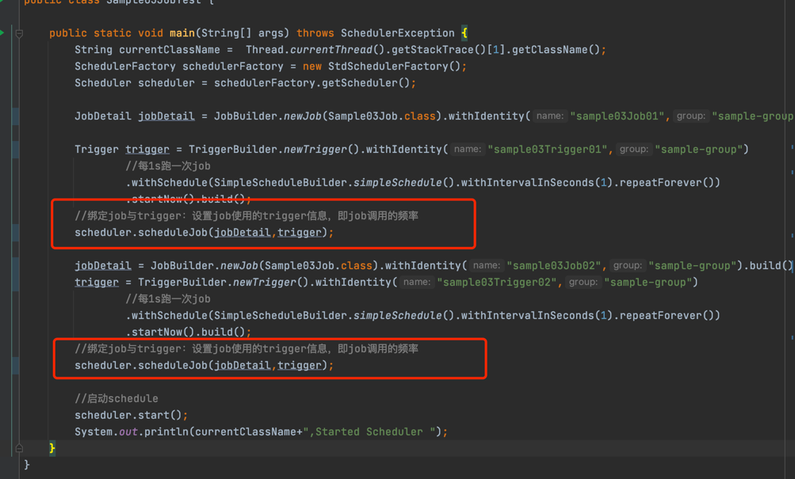

# schedule  全局单例 

```java
  public static void main(String[] args) throws SchedulerException {
        String currentClassName =  Thread.currentThread().getStackTrace()[1].getClassName();
        SchedulerFactory schedulerFactory = new StdSchedulerFactory();
        Scheduler scheduler = schedulerFactory.getScheduler();

        JobDetail jobDetail = JobBuilder.newJob(Sample03Job.class).withIdentity("sample03Job01","sample-group").build();

        Trigger trigger = TriggerBuilder.newTrigger().withIdentity("sample03Trigger01","sample-group")
                //每1s跑一次job
                .withSchedule(SimpleScheduleBuilder.simpleSchedule().withIntervalInSeconds(1).repeatForever())
                .startNow().build();
        //绑定job与trigger：设置job使用的trigger信息，即job调用的频率
        scheduler.scheduleJob(jobDetail,trigger);

        jobDetail = JobBuilder.newJob(Sample03Job.class).withIdentity("sample03Job02","sample-group").build();
        trigger = TriggerBuilder.newTrigger().withIdentity("sample03Trigger02","sample-group")
                //每1s跑一次job
                .withSchedule(SimpleScheduleBuilder.simpleSchedule().withIntervalInSeconds(1).repeatForever())
                .startNow().build();
        //绑定job与trigger：设置job使用的trigger信息，即job调用的频率
        scheduler.scheduleJob(jobDetail,trigger);

        //启动schedule
        scheduler.start();
        System.out.println(currentClassName+",Started Scheduler ");
    }
```


