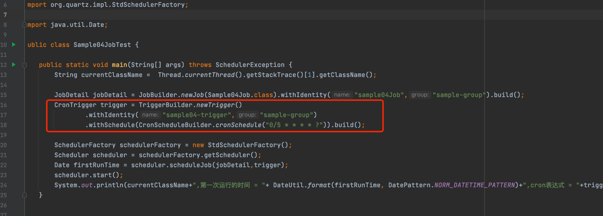

# 使用Cron表达式来设置 定时任务的触发时间

```java
        String currentClassName =  Thread.currentThread().getStackTrace()[1].getClassName();

        JobDetail jobDetail = JobBuilder.newJob(Sample04Job.class).withIdentity("sample04Job","sample-group").build();
        CronTrigger trigger = TriggerBuilder.newTrigger()
                .withIdentity("sample04-trigger","sample-group")
                .withSchedule(CronScheduleBuilder.cronSchedule("0/5 * * * * ?")).build();

        SchedulerFactory schedulerFactory = new StdSchedulerFactory();
        Scheduler scheduler = schedulerFactory.getScheduler();
        Date firstRunTime = scheduler.scheduleJob(jobDetail,trigger);
        scheduler.start();
        System.out.println(currentClassName+",第一次运行的时间 = "+ DateUtil.format(firstRunTime, DatePattern.NORM_DATETIME_PATTERN)+",cron表达式 = "+trigger.getCronExpression());
    

```
**运行结果 每5s运行一次**
```javascript
com.gaoxinfu.quartz.sample.standalone.sample04.Sample04JobTest,第一次运行的时间 = 2022-03-16 15:24:35,cron表达式 = 0/5 * * * * ?
Sample02Job,运行时间 currentDate = 2022-03-16 15:24:35.014,jobKey = sample-group.sample04Job
Sample02Job,运行时间 currentDate = 2022-03-16 15:24:40.006,jobKey = sample-group.sample04Job
Sample02Job,运行时间 currentDate = 2022-03-16 15:24:45.002,jobKey = sample-group.sample04Job
Sample02Job,运行时间 currentDate = 2022-03-16 15:24:50.006,jobKey = sample-group.sample04Job
Sample02Job,运行时间 currentDate = 2022-03-16 15:24:55.003,jobKey = sample-group.sample04Job
Sample02Job,运行时间 currentDate = 2022-03-16 15:25:00.003,jobKey = sample-group.sample04Job
```
**cron表达式**


